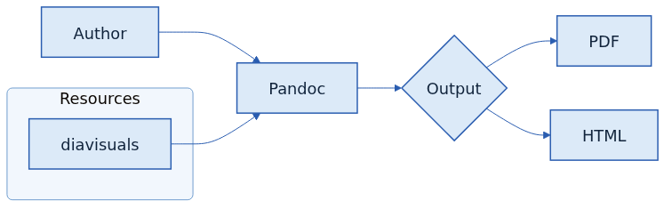
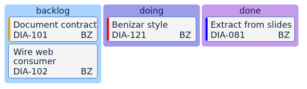
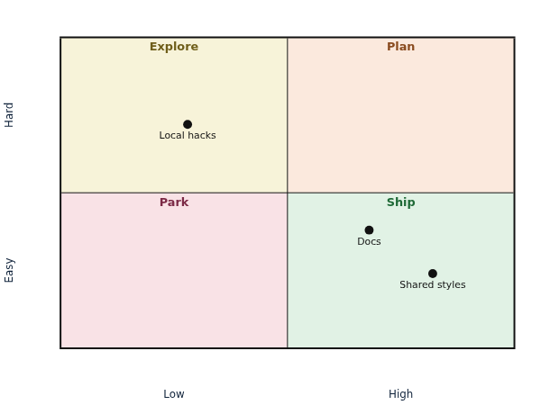
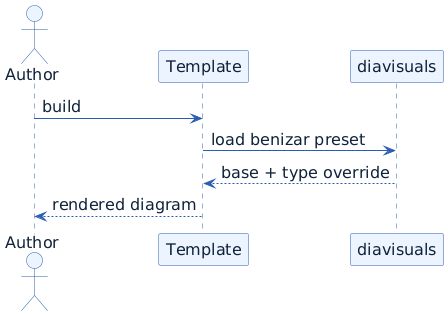
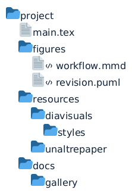
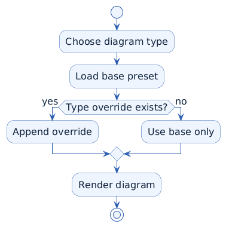

# diavisuals

   

`diavisuals` centralizes shared Mermaid and PlantUML visual styles and the
Docker renderer used by dosquartsdedocs projects. The goal is to stop copying
one-off CSS, `skinparam` fragments, Mermaid CLI, PlantUML, Chromium, and Java
layers into each paper, website, or slide deck, and to keep one tested render
contract for technical diagrams.

The first complete family is `benizar`, extracted from the previous `my-slides-vault` work. The repository is prepared for additional families such as `tonidomo` or `urv`, following the `<family>-mermaid` and `<family>-plantuml` naming convention.

## Contents

```text
styles/
  mermaid/
    benizar-mermaid.json
    benizar-mermaid/<diagram-type>.mmd
  plantuml/
    benizar-plantuml.puml
    benizar-plantuml/<diagram-type>.puml
tokens/
  benizar.yml
compat/
docs/
examples/
tools/
```

The repository has two style layers:

- One engine-level preset: `benizar-mermaid.json` and `benizar-plantuml.puml`.
- Small per-diagram-type overrides: `quadrantchart`, `block`, `treemap`, `sequence`, `class`, `state`, and so on.

That split matters because a quadrant chart, a sequence diagram, and a treemap need different visual decisions.

## Quick Use

Build the shared renderer image once:

```bash
make mcp-build
```

Force-remove any active renderer containers owned by this factory without
removing images, volumes, or unrelated containers:

```bash
make mcp-down
```

Render a diagram source file from a consumer project:

```bash
diavisuals --project /path/to/project render-diagram \
  --engine auto \
  --family benizar \
  --format svg \
  figures/pipeline.mmd \
  figures/pipeline.svg
```

Agents can also send diagram source text directly and receive the generated
artifact metadata plus inline SVG or base64 image data:

```bash
printf 'flowchart TD\n  A --> B\n' | \
  diavisuals --project /path/to/project render-diagram-text --format svg
```

See `docs/integration.md` for how `unaltrepaper`, `unaltraweb`, and `my-slides-vault` should consume the package, `docs/style-families.md` for the family contract, and `docs/style-contract.md` for the engine style contract.

Submodule mode is still available when a repository explicitly wants Git to own
the shared checkout:

```bash
diavisuals submodule-plan --path docs/slides/resources/diavisuals
```

## CLI And MCP Renderer

`diavisuals` can run as a lightweight MCP server. The MCP helps agents discover
style families, compatibility profiles, releases, examples, and style audits,
and it is also the shared rendering engine for Mermaid and PlantUML diagrams.
Consumer repositories should call this MCP/CLI instead of carrying Mermaid,
PlantUML, Chromium, or Java dependencies themselves.

```bash
diavisuals style-inventory
diavisuals style-audit
diavisuals compatibility-status
diavisuals check
diavisuals release-status
diavisuals render-diagram source.mmd output.svg
diavisuals render-diagram-text --text 'flowchart TD; A-->B'
diavisuals mcp client-config
```

The stdio MCP server is:

```bash
diavisuals --project /path/to/consumer-repo mcp serve
```

The root `mcp-factory.yml` file is a static discovery contract for external
launchers such as ContExt. A launcher can scan sibling Git repositories under
`~/git`, read that file, and call stable JSON commands such as `check`,
`update`, `install-codex-mcp`, and `mcp client-config`.

## Rendered Gallery

The default gallery is generated for the current release target `v0.2.0`. That short release tag points to the compatibility profile `mermaid-11.4.2-plantuml-1.2026.1`: Mermaid CLI 11.4.2 and PlantUML 1.2026.1, matching the modern diagram support used by `my-slides-vault`. The full manifest is [`docs/gallery/benizar/mermaid-11.4.2-plantuml-1.2026.1/manifest.csv`](docs/gallery/benizar/mermaid-11.4.2-plantuml-1.2026.1/manifest.csv).

README previews are generated as PNG thumbnails from the same examples as the full SVG gallery. Mermaid SVG output uses native text where supported and preserves inter-word `tspan` whitespace for print and conversion tools.

| Mermaid workflow | Mermaid board | Mermaid decision matrix |
| --- | --- | --- |
|  |  |  |

| PlantUML sequence | PlantUML files | PlantUML activity |
| --- | --- | --- |
|  |  |  |

Regenerate the gallery with:

```bash
make render-gallery
```

The older `mermaid-10.9.1-plantuml-1.2020.02` profile remains available to document what the previous Ubuntu-package-based paper image rendered.

## Compatibility Profiles

Files under `compat/` define which Mermaid and PlantUML versions are part of a rendering guarantee. Child projects should pin a short SemVer tag such as `v0.1.0` and declare the compatibility profile they support. If a new engine version changes support for `block`, `kanban`, `treemap`, `@startfiles`, `@startjson`, or another diagram type, add a new profile instead of changing the meaning of an existing one.

See `docs/versioning.md` for the versioning policy, `docs/releases.md` for the release matrix, and `docs/supported-diagrams.md` for the diagram type map.

## Consumers

This repository does not build full documents. It provides style assets, examples, compatibility profiles, and rendering checks. Consumers own their local pipelines:

- `my-slides-vault`: slide decks and Lua filters.
- `unaltrepaper`: papers, submissions, revisions, and latexdiff outputs.
- `unaltrepaperalpap`: public paper demo.
- `unaltraweb`: manuals and websites that can pre-render `.mmd` or `.puml` files.

## Checks

```bash
make check
make tests
```

Render the default compatibility gallery through Docker:

```bash
make render-gallery
```

If Mermaid CLI and PlantUML are already installed locally, render examples without Docker:

```bash
make render-examples
```

Optional packaging and MCP smoke tests:

```bash
make tests-install
make tests-mcp
```
