# Galeria renderitzada

Perfil: `mermaid-10.9.1-plantuml-1.2020.02`

- Mermaid CLI: 10.9.1
- PlantUML: 1.2020.02
- Familia: `benizar`

El manifest de renderitzat viu en [`gallery/benizar/mermaid-10.9.1-plantuml-1.2020.02/manifest.csv`](gallery/benizar/mermaid-10.9.1-plantuml-1.2020.02/manifest.csv). Els tipus marcats com `unsupported` tenen exemple font i estil, pero no formen part de la garantia d'aquest parell de motors.

## Mermaid

| Tipus | Render |
| --- | --- |
| class |  |
| er | 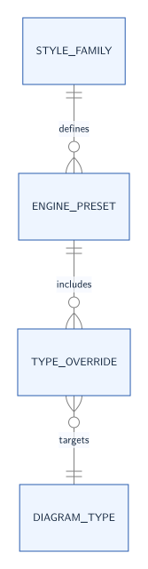 |
| flowchart |  |
| gantt | 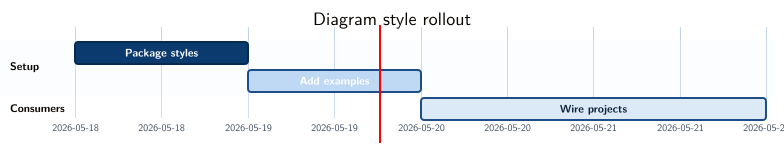 |
| gitgraph |  |
| journey |  |
| pie | 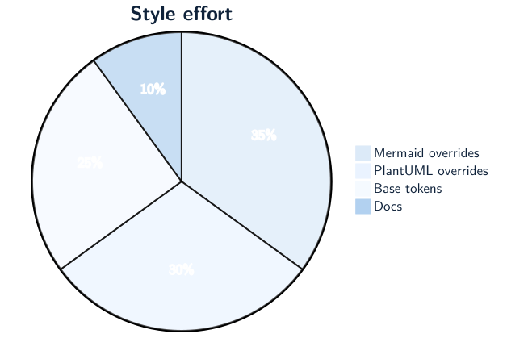 |
| quadrantchart | 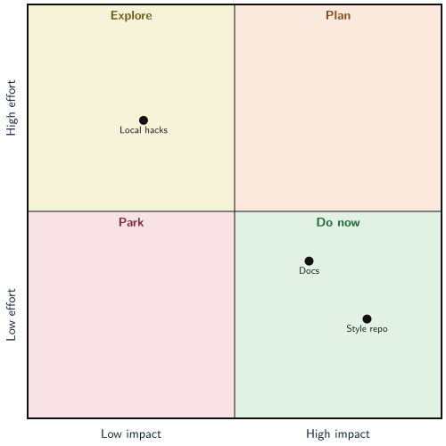 |
| sankey | 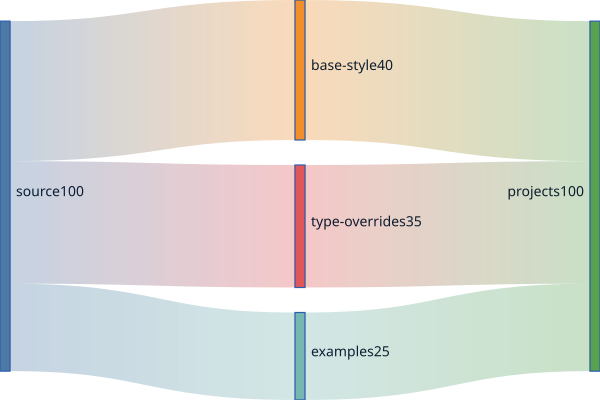 |
| sequence | 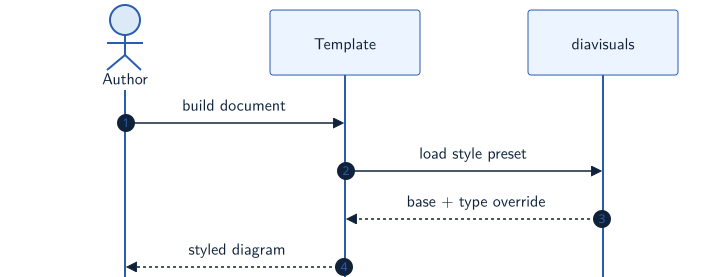 |
| state | 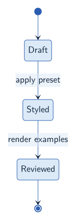 |
| timeline | 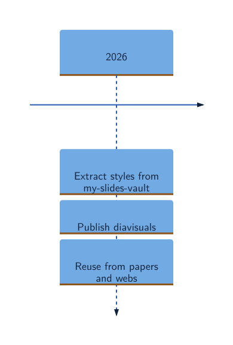 |

Unsupported in this profile: `block`, `kanban`, `treemap`.

## PlantUML

| Tipus | Render |
| --- | --- |
| activity | 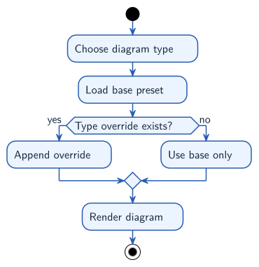 |
| class | 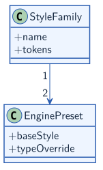 |
| component | 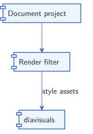 |
| deployment | 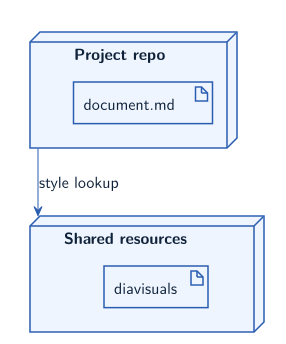 |
| mindmap | 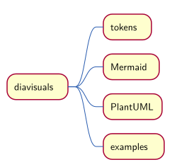 |
| object | 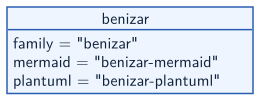 |
| salt |  |
| sequence | 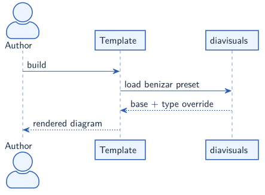 |
| state | 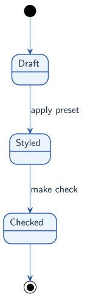 |
| usecase | 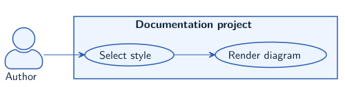 |
| wbs | 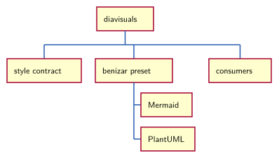 |

Unsupported in this profile: `files`, `gantt`, `json`, `yaml`.
