# Rendered Gallery

Release: `v0.3.1` (uses the `v0.3.0` renderer image)

- Compatibility profile: `mermaid-11.16.0-plantuml-1.2026.1`
- Mermaid CLI: 11.16.0
- PlantUML: 1.2026.1
- Family: `benizar`

The render manifest lives at [`gallery/benizar/mermaid-11.16.0-plantuml-1.2026.1/manifest.csv`](gallery/benizar/mermaid-11.16.0-plantuml-1.2026.1/manifest.csv). Types marked as `unsupported` have source examples and style files, but are not guaranteed by that profile. The compatibility profile id is not a Git tag; releases use short SemVer tags such as `v0.1.0`.

## Mermaid

| Type | Render |
| --- | --- |
| block |  |
| class |  |
| er |  |
| flowchart |  |
| gantt | 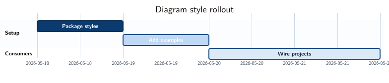 |
| gitgraph |  |
| journey | 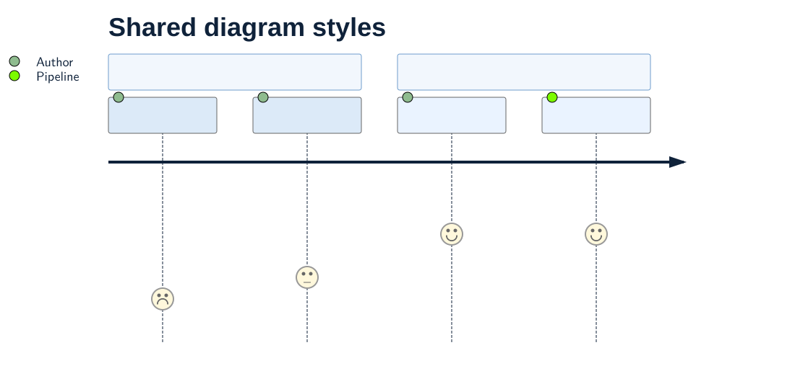 |
| kanban |  |
| pie | 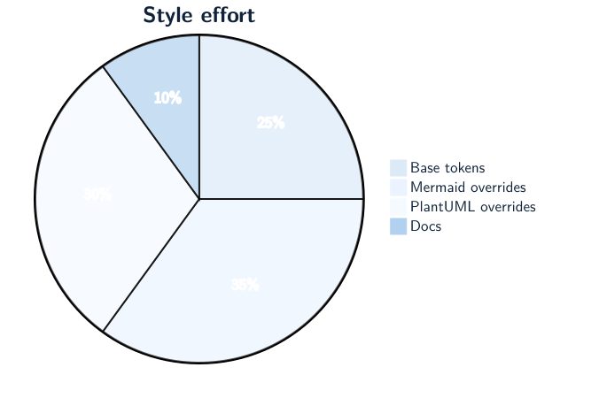 |
| quadrantchart | 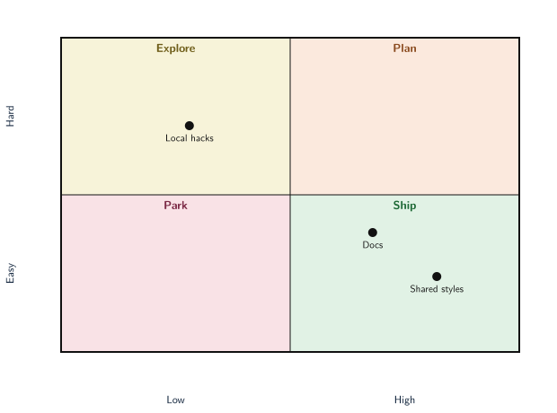 |
| sankey | 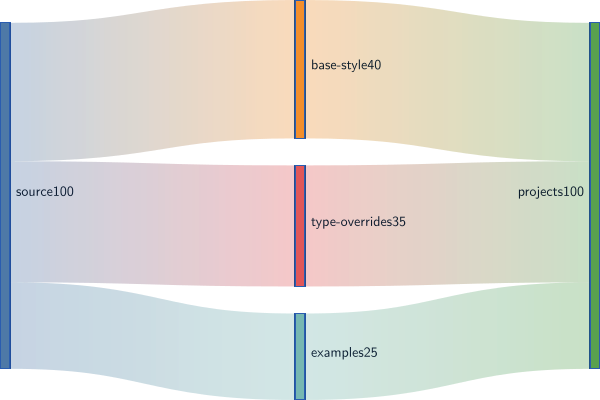 |
| sequence | 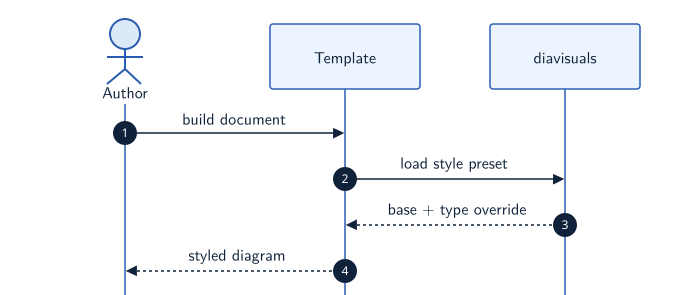 |
| state |  |
| timeline | 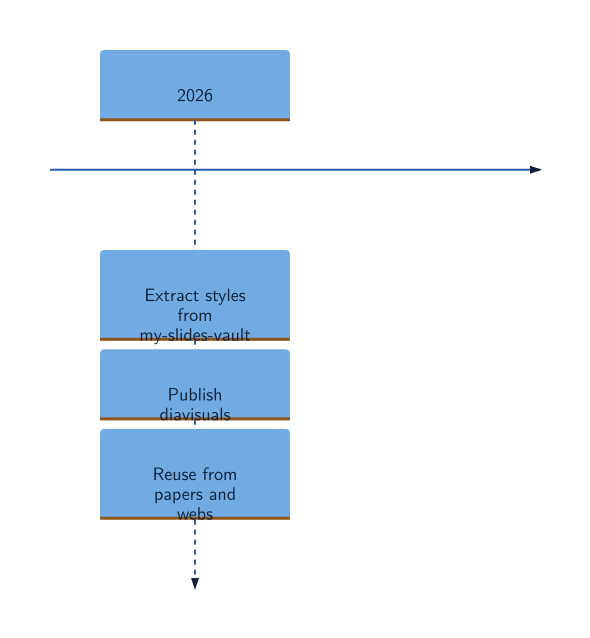 |
| treemap | 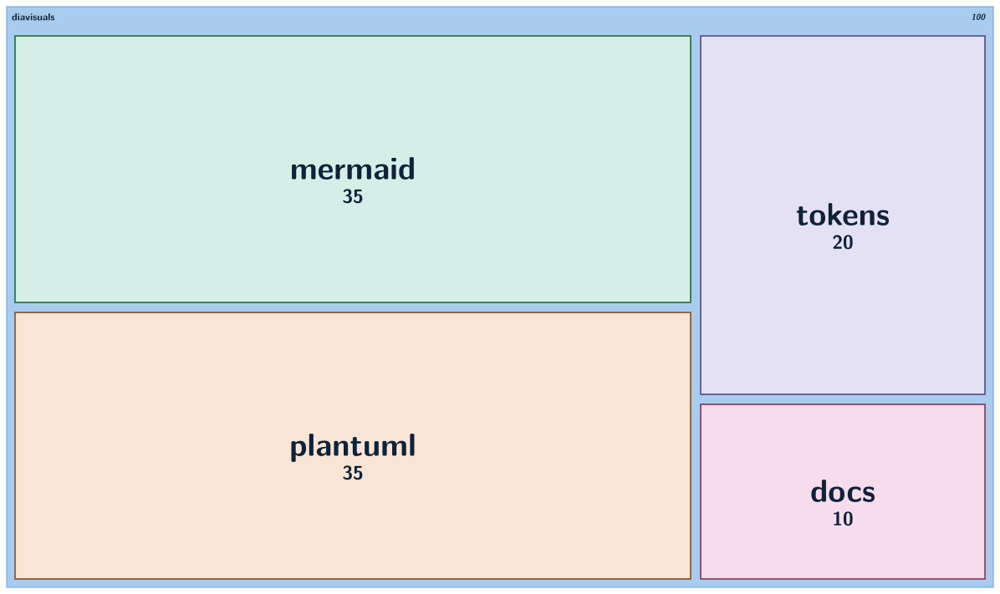 |

## PlantUML

| Type | Render |
| --- | --- |
| activity | 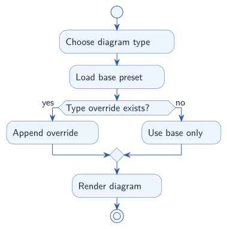 |
| class | 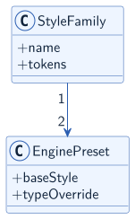 |
| component | 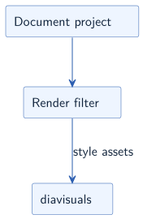 |
| deployment | 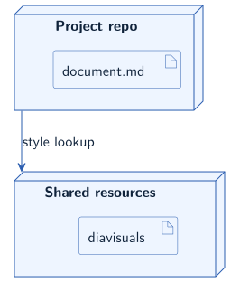 |
| files | 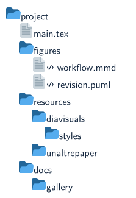 |
| gantt | 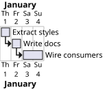 |
| json | 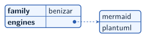 |
| mindmap | 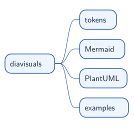 |
| object | 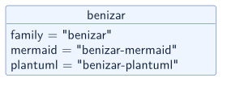 |
| salt |  |
| sequence | 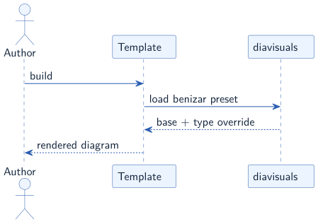 |
| state | 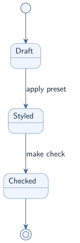 |
| usecase | 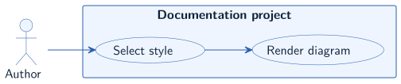 |
| wbs | 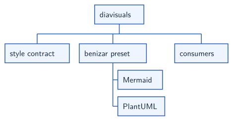 |
| yaml |  |

## Legacy Profiles

The older `mermaid-10.9.1-plantuml-1.2020.02` and `mermaid-11.4.2-plantuml-1.2026.1` galleries remain available under `gallery/benizar/`. They document record-only compatibility contracts and are not rebuilt by the current release.
